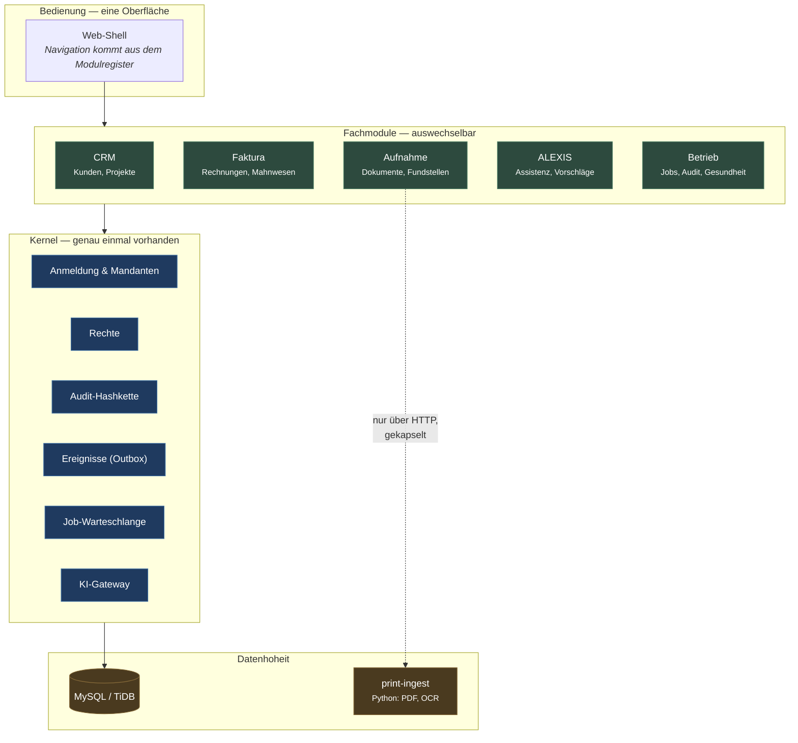
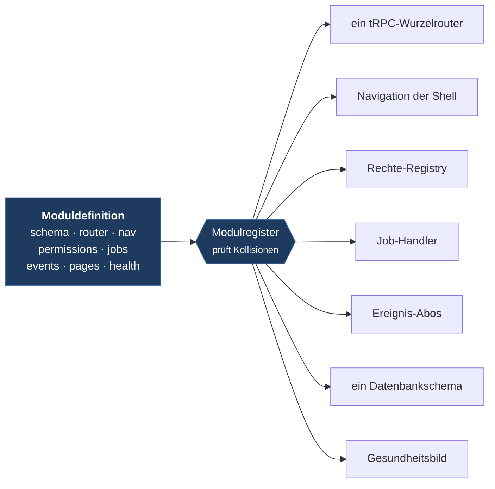
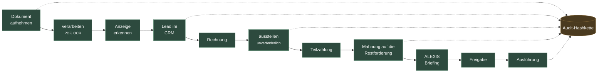
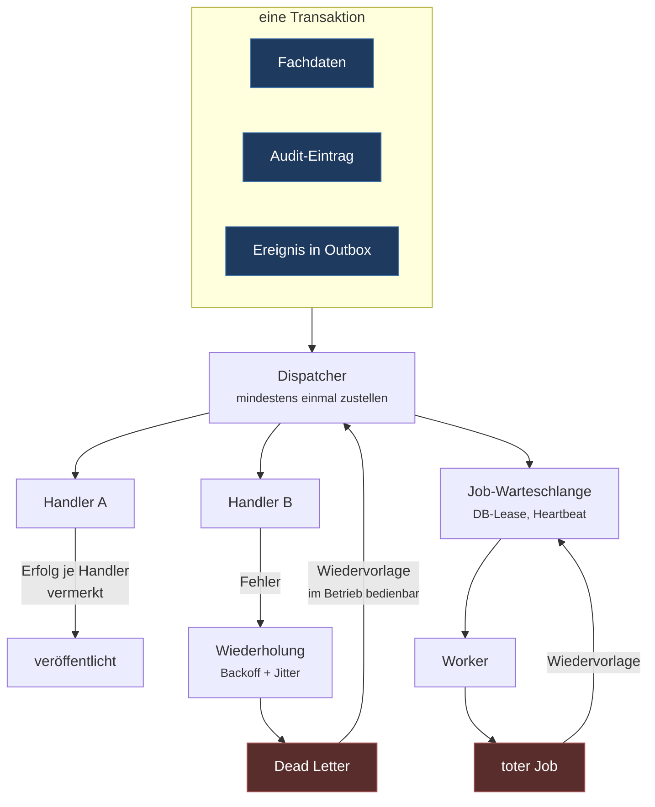
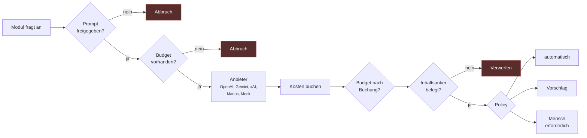

# xMaster Center — Architektur und Entscheidungsgrundlage

Dieses Dokument beschreibt, wie die fünf eingebrachten Systeme zu einer Plattform verschweißt sind, **warum** die Schnitte so liegen, und welche Entscheidungen als Nächstes zu treffen sind. Es ist als Entscheidungsgrundlage geschrieben, nicht als Referenzhandbuch: jeder Abschnitt endet dort, wo eine Wahl ansteht.

---

## 1. Die Kernidee

Die fünf Pakete waren keine fünf Produkte, sondern **fünf Abschnitte desselben Wertstroms**, die jeder für sich Auth, Audit, Speicher, Jobs und KI-Aufrufe nachgebaut hatten. Manus und TB Neo sind sogar Forks derselben Basis.

Daraus folgt der zentrale Schnitt der Plattform:

> Alles, was mehrfach vorhanden war, existiert genau einmal im **Kernel**. Alles Fachliche liegt in **Modulen**, die sich über **einen** Vertrag anmelden.

Der Nutzen ist nicht Ordnung, sondern Zwang: ein Modul kann Auth, Mandanten, Rechte oder Audit nicht umgehen, weil es keinen zweiten Weg an die Daten gibt. „Aus einer Hand bedienbar“ ist damit keine Fleißarbeit an der Oberfläche, sondern eine Eigenschaft der Struktur.



**Woher kommt was:**

| Eingebrachtes System | Beitrag | Verbleib |
|---|---|---|
| xMasterCenter v3 | modulare Struktur, CRM, Projekte, Mandanten | Grundriss der Plattform + CRM-Modul |
| Manus v2 | ALEXIS, Workflows, Dokumente, Verträge | ALEXIS-Modul; Workflows als Ausbaustufe |
| TB Platform Neo | deutsche Anzeigen-/Faktura-Fachlogik, Mahnwesen, E-Rechnung | Faktura-Modul; Fachformeln portiert |
| AnzeigenWerk AI | Massenimport, Provider-Jury, Prompt-Lab, Human Review, Kostenkontrolle | **Qualitätsregime im KI-Gateway** (plattformweit statt modulintern) |
| Print Intelligence | PDF-Beschaffung, SSRF-Schutz, Rendering, OCR, Fundstellen | Python-Dienst, bewusst nicht nachgebaut |

Die interessanteste Entscheidung steckt in AnzeigenWerk: dort war die Qualitätssicherung (freigegebene Prompts, Kostengrenzen, Prüfung gegen den Originaltext, Mehrfachbewertung) **an das eine Fachmodul gebunden**. Sie ist jetzt Eigenschaft des Gateways — damit gilt sie für jeden KI-Aufruf der ganzen Plattform, auch für künftige Module, die es noch nicht gibt.

---

## 2. Der Modulvertrag — warum ein neues Modul „einfach da“ ist

Ein Modul liefert ein einziges Objekt ab. Das Register faltet daraus die gesamte Laufzeit zusammen.



Konsequenzen, die für Entscheidungen zählen:

- **Ein neues Modul erfordert keine Änderung an der Shell.** Es erscheint im Menü, sobald es registriert ist. Neue Fachbereiche kosten deshalb Fachlogik, kaum Integration.
- **Kollisionen fallen beim Start auf**, nicht im Betrieb: doppelte Modul-IDs, Rechte, Job-Namen oder Tabellennamen brechen den Start ab.
- **Rechte sind deklariert und werden durchgesetzt.** Genau hier lag ein Fehler, den das Review aufgedeckt hat: die neuen Requeue-Rechte waren angemeldet, aber die Prozeduren hingen noch am Leserecht. Deklaration allein genügt nicht — der Vertrag macht solche Lücken auffindbar, nicht unmöglich.

---

## 3. Der Wertstrom — was die Plattform durchgehend leistet

Das ist der Teil, der bereits nachgewiesen ist (End-to-End getestet, siehe PR #1):



Der Beweis, dass der Strom wirklich **fachlich** zusammenhängt und nicht nur technisch, ist die Mahnung: sie rechnet auf der offenen Restforderung, nicht auf dem Rechnungsbetrag.

```
238,00 €  Rechnung
-100,00 €  Teilzahlung
────────
 138,00 €  offen
+  5,00 €  Mahngebühr
+  0,57 €  Verzugszins  (138,00 × 5 % × 30/365)
────────
 143,57 €  Mahnforderung
```

Auf dem Gesamtbetrag wären es **243,98 €** gewesen — ein Fehler, der im Rechtsverkehr teuer wird. Geld wird deshalb durchgehend als Dezimalzeichenkette geführt und intern mit Ganzzahlen gerechnet; Gleitkomma kommt an Beträge nicht heran.

---

## 4. Automatisierung — warum nichts verloren geht

Fachdaten, Audit-Eintrag und Ereignis werden **in einer Transaktion** geschrieben. Ein Ereignis kann also nicht ohne seinen Vorgang existieren und ein Vorgang nicht ohne Spur.



Zwei Eigenschaften sind hier wichtiger, als sie klingen:

- **Erfolg wird pro Handler vermerkt.** Ein fehlerhafter Empfänger blockiert weder die Schlange noch löst er bei erfolgreichen Empfängern eine zweite Ausführung aus. Ohne das würde eine Wiederholung Rechnungen doppelt buchen.
- **Wiedervorlage ist ein Bedienvorgang, kein Datenbankeingriff.** Der Test hat gezeigt, warum: ein einmal gescheitertes `advertisement.detected` fiel wegen der Inhalts-Hash-Deduplizierung **dauerhaft** aus — erneutes Aufnehmen half nicht, es musste per Hand in der Datenbank repariert werden. Tote Jobs und Dead Letters lassen sich jetzt in der Betriebsansicht erneut einreihen, mandantengebunden, rechtegebunden, auf den Zustand `dead` begrenzt und im Audit protokolliert.

Die Zustandsgrenze ist kein Formalismus: ohne sie hätte eine Wiedervorlage einem **laufenden** Job die Lease entzogen und ihn doppelt ausgeführt — bei Faktura-Nebenwirkungen ein echter Schaden.

---

## 5. KI — ein einziger Durchlass mit Kontrollpunkten

Kein Fachmodul spricht mit einem Anbieter. Alles läuft durch das Gateway, und zwar durch diese Reihenfolge:



Damit sind drei Risiken strukturell begrenzt statt durch Disziplin: **unfreigegebene Prompts** gehen nicht in den Betrieb, **Kosten** haben einen harten Stopp vor *und* nach dem Aufruf, und **Erfindungen** werden gegen den Originaltext geprüft. Die Policy entscheidet je Vorgang, ob KI selbst handeln darf, nur vorschlagen darf oder einen Menschen braucht — bei ALEXIS sind Freigabe und Ausführung deshalb bewusst zwei getrennte Schritte.

> **Stand:** Es sind keine Anbieterschlüssel hinterlegt, alle Läufe gingen gegen den Mock. Die Wege sind nachgewiesen, die Antwortqualität echter Modelle ist es nicht.

---

## 6. Datenhoheit und die eine bewusste Fremdtechnologie

Alles läuft auf MySQL/TiDB über ein einziges zusammengeführtes Schema — eine Datenbank, ein Mandantenbegriff, eine Audit-Kette. Die Kette bindet `seq`, Vorgänger-Hash, Mandant, Aktion, Objekt, Nutzlast und Zeitstempel; nachträgliche Änderungen brechen sie sichtbar, prüfbar per Knopfdruck in der Oberfläche.

**Die eine Ausnahme ist `print-ingest`.** PDF-Rendering und OCR (PyMuPDF, Tesseract) in TypeScript nachzubauen wäre reiner Verlust gewesen. Der Dienst bleibt Python und ist gekapselt: erreichbar nur intern, mit Dienst-Token, und mit dem SSRF-Schutz aus Print Intelligence — private, Loopback-, Link-Local- und reservierte Adressen werden abgewiesen, auch wenn ein Name erst per DNS oder über eine Weiterleitung dorthin zeigt, dazu Prüfung der PDF-Signatur und ein Größenlimit. Dieser Schutz ist die Bedingung dafür, dass später **echte externe Quellen** abgerufen werden dürfen.

---

## 7. Entscheidungslandkarte

Die Grundlage steht. Was jetzt kommt, ist eine Reihenfolgeentscheidung — und die vier Stränge unterscheiden sich stark in Nutzen und Voraussetzungen.

```mermaid
flowchart TB
    subgraph A["A — Kaufmännisch fertig machen"]
        A1["Kettenrechnungen"] --> A2["Angebote"]
        A2 --> A3["Settlement-Import"]
        A3 --> A4["SEPA / EPC-QR"]
        A4 --> A5["E-Rechnung (XRechnung/ZUGFeRD)"]
        A5 --> A6["DATEV / GoBD-Export"]
    end
    subgraph B["B — Produktion mit KI"]
        B1["Anbieterschlüssel"] --> B2["Restaurierung aus AnzeigenWerk"]
        B2 --> B3["Human-Review-Fabrik"]
        B3 --> B4["Provider-Jury im Betrieb"]
    end
    subgraph C["C — Beschaffung real"]
        C1["echte Quellen freischalten"] --> C2["Upload-Dialog"]
        C2 --> C3["Massenimport"]
    end
    subgraph D["D — Betreuung ausbauen"]
        D1["ALEXIS: mehr Fachfragen"] --> D2["Workflows aus Manus"]
        D2 --> D3["proaktive Automatisierung"]
    end
```



| Strang | Nutzen | Voraussetzung von dir | Aufwand |
|---|---|---|---|
| **A — Kaufmännisch** | macht die Plattform **rechnungsfähig**; E-Rechnung ist bei öffentlichen Auftraggebern Pflicht, DATEV/GoBD macht den Steuerberater anschlussfähig | Nummernkreise, Zahlungsziele, DATEV-Mandantendaten | A1–A3 zusammen ~1 Session; A4–A6 je ~1 Session, E-Rechnung braucht Validierung gegen echte Prüfwerkzeuge |
| **B — KI produktiv** | löst das größte offene Versprechen ein: KI **betreut** statt nur zu antworten | **Anbieterschlüssel** (OpenAI/Gemini/xAI) und ein Kostenrahmen je Mandant | ~1 Session bis erste echte Läufe, Review-Fabrik ~1–2 weitere |
| **C — Beschaffung** | füllt den Wertstrom mit echten Dokumenten statt Demo-PDF; ohne das bleibt A und B datenarm | Freigabe für ausgehende Abrufe, Liste der Quellen | ~1 Session |
| **D — Betreuung** | Hebel auf das Tagesgeschäft, aber am wenigsten wert, solange A/C dünn sind | fachliche Regeln, was ALEXIS selbst entscheiden darf | ~1–2 Sessions |

**Meine Empfehlung: C → B → A → D.** Begründung: Beschaffung ist der billigste Strang und macht alle anderen erst aussagekräftig — echte Dokumente ergeben echte Fundstellen, echte Leads, echte Rechnungen. Danach B, weil die Kontrollpunkte (Freigabe, Budget, Anker, Policy) bereits stehen und nur noch Schlüssel und ein Kostenrahmen fehlen; der Nutzen pro Aufwand ist dort am höchsten. A ist der größte Strang, aber gut planbar und kann parallel laufen, sobald echte Belege vorliegen. D zuletzt, weil Automatisierung erst dann Wert hat, wenn es genug echtes Geschäft gibt, das sie betreuen kann.

**Wenn dein Ziel ein Termin bei einem öffentlichen Auftraggeber ist**, dreht sich das: dann zuerst A5/A6 (E-Rechnung, GoBD), weil das eine Zulassungsfrage ist und keine Komfortfrage.

---

## 8. Was ehrlich noch nicht belegt ist

| Punkt | Stand |
|---|---|
| Antwortqualität echter KI-Modelle | nicht geprüft — alle Läufe gegen Mock |
| externer PDF-Abruf | nicht durchgeführt; Schutz vorhanden, Praxis fehlt |
| E-Rechnung, DATEV/GoBD, SEPA, Settlement, Kettenrechnungen, Angebote | Datenmodell vorbereitet, Fachlogik offen |
| Restaurierungs-/Review-Fabrik | Qualitätsregime im Gateway vorhanden, eigenes Modul offen |
| Upload-Dialog für Dokumente | fehlt, Aufnahme läuft über Demo-Weg |
| CI | für das Repository sind keine Checks registriert; belegt sind lokale `check`/`test`/`build` |
| Betrieb unter Last | nie unter Last gelaufen; Lease-Queue und Backoff sind ausgelegt, aber unbewiesen |
